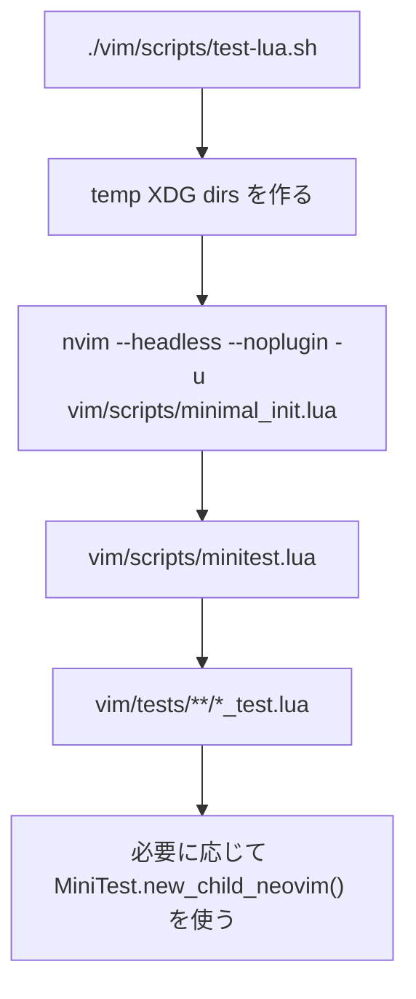

# ABOUT_TEST

## Purpose

このディレクトリ配下の Neovim Lua 設定に対して、`mini.test` ベースの headless test を実行するためのメモです。  
対象は `vim/` 配下の Lua runtime で、test harness も同じ `vim/` ツリーに置いています。

## Layout

| Path | Role |
| --- | --- |
| `vim/deps/mini.nvim` | `mini.test` を含む test-only dependency |
| `vim/scripts/minimal_init.lua` | test 用の最小 init |
| `vim/scripts/minitest.lua` | `*_test.lua` を集めて `MiniTest.run()` する thin wrapper |
| `vim/scripts/test-lua.sh` | XDG を一時ディレクトリへ逃がして test を起動する shell wrapper |
| `vim/tests/` | test file 本体 |
| `vim/tests/helpers.lua` | child Neovim, stub, scratch buffer などの共通 helper |

## Flow

## Commands

| Purpose | Command |
| --- | --- |
| 全 test 実行 | `./vim/scripts/test-lua.sh` |
| 特定 file だけ実行 | `./vim/scripts/test-lua.sh vim/tests/commands/selectors_test.lua` |
| test file の整形 | `stylua vim/scripts vim/tests` |
| test file の構文確認 | `find vim/scripts vim/tests -name '*.lua' -print0 \| xargs -0 -n1 luac -p` |

## How It Works

- `vim/scripts/test-lua.sh` は `XDG_CACHE_HOME`, `XDG_STATE_HOME`, `XDG_DATA_HOME` を一時ディレクトリへ向ける。
- `vim/scripts/minimal_init.lua` は `loadplugins = false`, `shada = ""` を設定し、`runtimepath` には repo の `vim/` と `vim/deps/mini.nvim` だけを追加する。
- `vim/scripts/minitest.lua` は `vim/tests/**/*_test.lua` を収集する。`mini.test` の既定は `test_*.lua` なので、この wrapper で repo の命名規則に合わせている。
- child Neovim を使う test は `nvim --listen` を使って RPC 接続する。

## Writing Tests

1. 対象 module に対応する `*_test.lua` を `vim/tests/` 配下へ追加する。
2. 共通化できる処理は `vim/tests/helpers.lua` に寄せる。
3. pure な変換は unit test、buffer/window/mark を使う挙動は child Neovim test、外部 plugin 依存は `package.loaded[...]` stub で切る。
4. 追加後は `stylua`, `luac -p`, `./vim/scripts/test-lua.sh` を通す。

## Notes

- full `vim/init.lua` は test bootstrap に使わない。通常 runtime の plugin auto-load や external dependency を避けるため、必ず `vim/scripts/minimal_init.lua` を使う。
- `vim/plugin/test_helper.lua` という runtime file が既にあるので、test helper は `vim/tests/helpers.lua` を使う。
- child Neovim test は socket 作成が必要なので、強い sandbox 環境では失敗することがある。その場合は通常のローカル shell で `./vim/scripts/test-lua.sh` を実行する。
