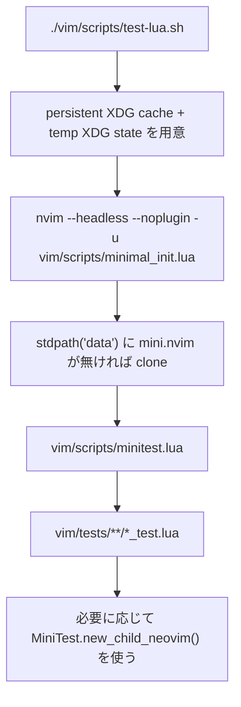

# ABOUT_TEST

## Purpose

このディレクトリ配下の Neovim Lua 設定に対して、`mini.test` ベースの headless test を実行するためのメモです。  
対象は `vim/` 配下の Lua runtime で、test harness も同じ `vim/` ツリーに置いています。

## Layout

| Path | Role |
| --- | --- |
| `vim/scripts/minimal_init.lua` | test 用の最小 init |
| `vim/scripts/minitest.lua` | `*_test.lua` を集め、source path を related test へ解決して `MiniTest.run()` する thin wrapper |
| `vim/scripts/test-lua.sh` | persistent cache, temp state, fixed `NVIM_APPNAME` で test を起動する shell wrapper |
| `vim/tests/` | test file 本体 |
| `vim/tests/helpers.lua` | child Neovim, in-process state cleanup, stub, scratch buffer などの共通 helper |

## Flow

## Commands

| Purpose | Command |
| --- | --- |
| 全 test 実行 | `./vim/scripts/test-lua.sh` |
| fast suite だけ実行 | `./vim/scripts/test-lua.sh --fast` |
| slow suite だけ実行 | `./vim/scripts/test-lua.sh --slow` |
| source file から関連 test を実行 | `./vim/scripts/test-lua.sh vim/plugin/lsp/ruby.lua` |
| plugin root file の関連 test を実行 | `./vim/scripts/test-lua.sh --fast vim/plugin/claudecode.lua` |
| source file の slow test だけ実行 | `./vim/scripts/test-lua.sh --slow vim/plugin/lsp/ruby.lua` |
| source directory から関連 test を実行 | `./vim/scripts/test-lua.sh vim/plugin/lsp` |
| plugin 配下の test をまとめて実行 | `./vim/scripts/test-lua.sh --fast vim/plugin` |
| 特定 test file だけ実行 | `./vim/scripts/test-lua.sh vim/tests/commands/selectors_test.lua` |
| test directory 単位で実行 | `./vim/scripts/test-lua.sh vim/tests/plugin/lsp` |
| 使い方表示 | `./vim/scripts/test-lua.sh --help` |
| test file の整形 | `stylua vim/scripts vim/tests` |
| test file の構文確認 | `find vim/scripts vim/tests -name '*.lua' -print0 \| xargs -0 -n1 luac -p` |

## How It Works

- `vim/scripts/test-lua.sh` は `XDG_CACHE_HOME` を persistent に保ち、`XDG_STATE_HOME` だけを一時ディレクトリへ向けつつ、`NVIM_APPNAME=dotfiles-test` を使って test 専用の `stdpath('data')` / `stdpath('cache')` を使う。
- `vim/scripts/minimal_init.lua` は `loadplugins = false`, `shada = ""` を設定し、repo の `vim/` を `runtimepath` に追加したうえで、`stdpath('data')/site/pack/deps/start/mini.nvim` に `mini.nvim` が無ければ `git clone` する。
- `mini.nvim` は初回実行時だけ clone され、以後は同じ `stdpath('data')` から再利用される。repo 内の `vim/deps/` は使わない。
- `vim/scripts/minitest.lua` は `vim/tests/**/*_test.lua` を収集する。`mini.test` の既定は `test_*.lua` なので、この wrapper で repo の命名規則に合わせている。
- `./vim/scripts/test-lua.sh vim/plugin/lsp/ruby.lua` のように source file を渡すと、runner が関連 test file へ解決して focused run を行う。Phase 2/3 の grouped test も override table で関連付けている。
- `vim/tests/plugin/*.lua` には plugin root wrapper と external integration の test を置いている。ここは command / keymap / autocmd 登録を main process で確認しつつ、`vim.system`, `vim.fn.jobstart`, `vim.fn.systemlist`, `os.execute`, `io.popen` の contract を stub して fast profile に残している。
- `--fast` は child Neovim を使わない test file、`--slow` は `helpers.new_child_neovim()` を使う test file だけを実行する。分類は file 本文の `new_child_neovim` usage で判定している。
- fast 側では `helpers.track_editor_state()` を使い、main process の mapping / command / autocmd / option / buffer state を case ごとに rollback する。単純な keymap/option/dispatch test はまずこちらを選ぶ。
- plugin file が `_G.open_github` や `_G.get_oil_winbar` のような Lua global function を生やす場合は、`helpers.track_editor_state({ lua_globals = { ... } })` で rollback する。
- child Neovim test では `helpers.new_child_neovim()` の `child.reset()` を使い、`pre_once = child.setup`, `pre_case = child.reset` で lightweight cleanup する。毎 case の `child.restart()` は避け、function stub、user command、autocmd、mapping、buffer/window state を child 内で戻す。
- child Neovim を使う test は `nvim --listen` を使って RPC 接続する。

## Writing Tests

1. 対象 module に対応する `*_test.lua` を `vim/tests/` 配下へ追加する。
2. 共通化できる処理は `vim/tests/helpers.lua` に寄せる。
3. pure な変換は unit test、mapping/command/option 登録のように main process cleanup で足りるものは `helpers.track_editor_state()` ベースの fast test、buffer/window/mark を強く使う挙動は child Neovim test、外部 plugin 依存は `package.loaded[...]` stub で切る。
4. grouped test にまとめる場合は `vim/scripts/minitest.lua` の source-to-test override も同時に更新し、source file から focused run できる状態を保つ。
5. user command 本体が `vim.cmd()` を内部で叩く test は、command dispatch に `vim.api.nvim_cmd()` を使うと `vim.cmd` 自体を stub しても test を組みやすい。
6. child Neovim test は、まず `pre_once = child.setup`, `pre_case = child.reset` を検討する。case ごとに process restart が要るのは、lightweight reset で戻せない global state があるときだけに絞る。
7. child Neovim を使う test file は `--slow` に入る。切り替えたくない場合は `new_child_neovim` 判定か profile override を更新する。
8. 追加後は `stylua`, `luac -p`, `./vim/scripts/test-lua.sh`, 必要に応じて `./vim/scripts/test-lua.sh --fast` / `--slow` を通す。2026-03-23 時点の suite は `101 cases / 50 groups` で、`--fast` が `77 cases / 42 groups`, `--slow` が `24 cases / 8 groups`。

## Notes

- full `vim/init.lua` は test bootstrap に使わない。通常 runtime の plugin auto-load や external dependency を避けるため、必ず `vim/scripts/minimal_init.lua` を使う。
- `vim/plugin/test_helper.lua` という runtime file が既にあるので、test helper は `vim/tests/helpers.lua` を使う。
- child Neovim test は socket 作成が必要なので、強い sandbox 環境では失敗することがある。その場合は通常のローカル shell で `./vim/scripts/test-lua.sh` を実行する。
- `mini.nvim` の初回取得には network が要る。更新や再取得が必要なら test 用 `stdpath('data')` 配下の `site/pack/deps/start/mini.nvim` を消してから再実行する。
- Neovim の test cache を掃除したい場合は test 用 `stdpath('cache')` 配下、通常は `~/.cache/dotfiles-test` を消す。
